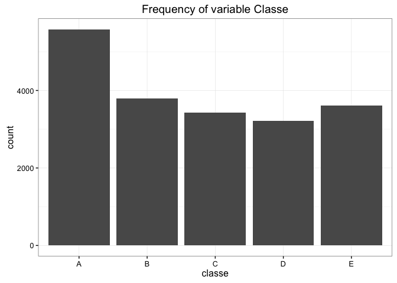
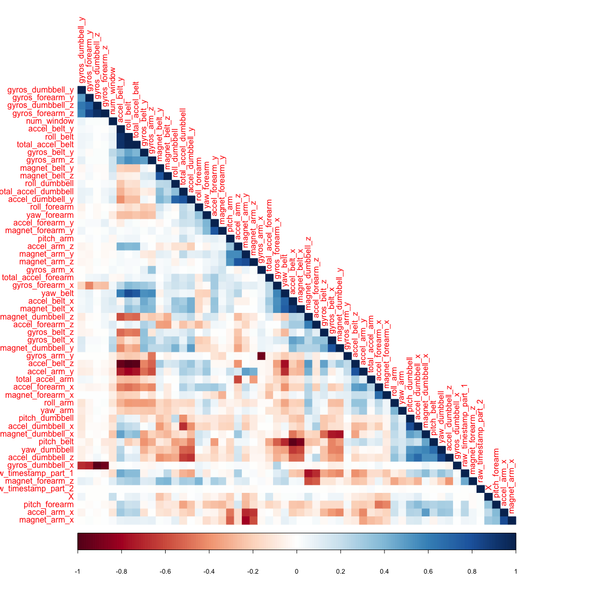
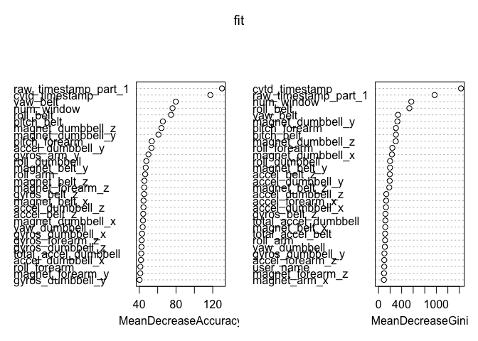

# Practical Machine Learning Course Project
Chiara Di Gravio  
10 September 2016  


### Synopsis

A large amount of data about personal activity have been collected. Data from accelerometers on the belt, forearm, arm and dumbell were used to quantify how well people perform a particular activity. Two different models were fit and the one with greater accurancy was used for prediction on the test set. Random forest gave the best accuracy measures (99%).

### Importing and cleaning data


```r
library(nnet)
library(randomForest)
library(corrplot)
library(ggplot2)

# train set
fileurl <- "https://d396qusza40orc.cloudfront.net/predmachlearn/pml-training.csv"
download.file(fileurl,"./pml-training.csv", method = "curl")
train <- read.csv("pml-training.csv", na.strings = c("NA",""))

# test set
fileurl <- "https://d396qusza40orc.cloudfront.net/predmachlearn/pml-testing.csv"
download.file(fileurl,"./pml-testing.csv", method = "curl")
test <- read.csv("pml-testing.csv", na.strings = c("NA",""))
```

There were 160 observations and 19622 in the train data, and 160 observations and 20 in the test data. The variable classe indicates how well an exercise was performed.


```r
table(train$classe)
```

```
## 
##    A    B    C    D    E 
## 5580 3797 3422 3216 3607
```

```r
ggplot(train, aes(classe)) + geom_bar() + theme_bw() + ggtitle("Frequency of variable Classe")
```

<!-- -->

Before running any analysis, we looked at the number of missing values in the dataset and we took only those variables with no missing values:


```r
# count NA for each variable
nacount <- apply(train, 2, function(x){sum(is.na(x) == T)})
# take those variables with no NA
train_clean <- train[, nacount == 0]
```

The number of variables reduced from 160 to 60. Finally, we looked at the correlaion matrix to devise the most appropriate strategy to use in the analysis.


```r
# take only numerical variables
# All data: PCA and regression
num <- c()
for(i in 1:ncol(train_clean)){
      num[i] <- is.numeric(train_clean[,i])
}
train_num <- train_clean[,num]
corrplot(cor(train_num), method = "color", type = "lower", order ="hclust")
```

<!-- -->

Many of the variables that came from the same part of the body are correlated; hence we needed to devise strategies that took this correlation in account.

#### Method 1: Multinomial Logistic Regression with Principal Components

To consider the presence of correlated variables, we first run a principal component analysis (PCA). Then, the component derived from the PCA were used as predictors in a multinomial model where classe was the outcome of interest. Finally, the results from the model were used for predictiong the class variable. 
The train dataset was not further divided in train and test data; however, to avoid overfitting, 5-fold cross validation was implemented:


```r
# use PCA in model with 5-fold CV
accurancy <- function(dat, n, k){
      # create the folds
      folds <- sample(rep(1:k,length=n))
      holdout <- rep(0,n)
      for(i in 1:k){
            # subset: index for each observation
            trainset <- dat[folds != i,] #Set the training set
            validation <- dat[folds == i,] #Set the validation set
            train_num <- trainset[,num]
            validation_num <- validation[,num]
            # fitting model on the training set
            pca <- princomp(train_num, cor = TRUE)
            components <- pca$scores
            mod1 <- multinom(trainset$classe ~ components, trace = F)
            # find predicted values using validation set
            predictions <- predict(mod1, newx = validation_num)
            # calculate accurancy
            acc <- sum(predict(mod1) == trainset$classe)/length(train$classe)
            # Put the cv predictions in the correct positions
            holdout[folds == i] <- acc}
      # function output
      holdout}

ma <- c()
for(i in 1:2){
      ma[i] <- mean(accurancy(train_clean, k = 5, n = nrow(train_clean)))
}
```

This first method led to an accurancy of 0.756.


### Method 2: Random Forest

To predict how well people perform the exercises, random forest was used as an alternative method to see whether accurancy could be ameliorate. Differenlty from the multinomial model, the train data was divided in training (60% of the data) and validation set (40% of the data).


```r
# divide train in train and validation
set.seed(123)
divider <- sample(1:2, nrow(train_clean), replace = T, prob = c(0.6,0.4))
train_tofit <- train_clean[which(divider == 1),]
val_tofit <- train_clean[which(divider == 2),]
# remove unused data
rm(train); rm(train_clean)
# remove id rown
train_tofit <- train_tofit[,-which(names(train_tofit) == "X")]
val_tofit <- val_tofit[,-which(names(val_tofit) == "X")]
```

The, random forest was implemented, and the most important variables for prediction purpose were plotted:


```r
# Random Forest
fit <- randomForest(classe ~ ., data=train_tofit, importance=TRUE, ntree=2000)
# important variables
varImpPlot(fit)
```

<!-- -->


```r
print(fit)
```

```
## 
## Call:
##  randomForest(formula = classe ~ ., data = train_tofit, importance = TRUE,      ntree = 2000) 
##                Type of random forest: classification
##                      Number of trees: 2000
## No. of variables tried at each split: 7
## 
##         OOB estimate of  error rate: 0.14%
## Confusion matrix:
##      A    B    C    D    E  class.error
## A 3356    1    0    0    0 0.0002978850
## B    1 2317    0    0    0 0.0004314064
## C    0    1 2052    2    0 0.0014598540
## D    0    0    8 1980    1 0.0045248869
## E    0    0    0    3 2150 0.0013934046
```


```r
# predict
predictions <- predict(fit, newdata = val_tofit)
sum(predictions == val_tofit$classe)/length(val_tofit$classe)
```

```
## [1] 0.9987097
```

The model reached an accurancy of 99.87%.

#### Conclusion

A simple random forest model led to a accurancy of 99%. Using more complex models seemed not useful as the predictions from random forest were mostly correct. Consequently, random forest was used to predict the 20 observations in the provided test set.


```r
# make sure that factor levels are the same in both dataset
levels(test$cvtd_timestamp) <- levels(train_tofit$cvtd_timestamp)
levels(test$new_window) <- levels(train_tofit$new_window)

# take only variables that are both in train and test set
test <- test[,names(test)[names(test) %in% names(train_tofit)]]

# predict
predictions <- predict(fit,test)
predictions
```

```
##  1  2  3  4  5  6  7  8  9 10 11 12 13 14 15 16 17 18 19 20 
##  B  A  B  A  A  E  D  B  A  A  B  C  B  A  E  E  A  B  B  B 
## Levels: A B C D E
```
