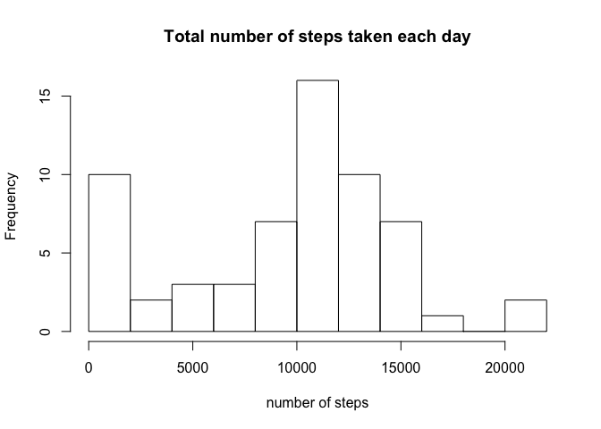
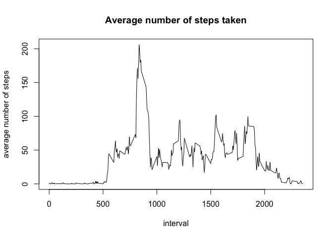
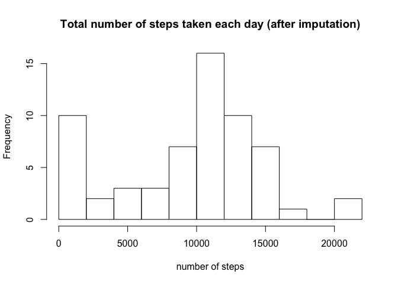
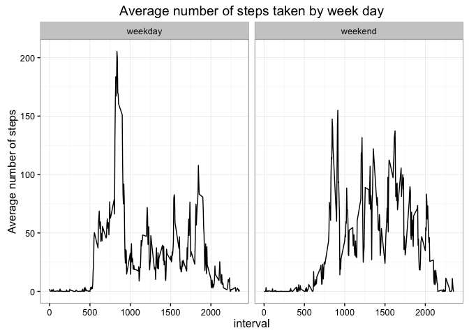

# Reproducible Research: Peer Assessment 1

The dataset comes from a personal activity monitoring device which collects data at 5 minute intervals through out the day. The dataset consists of two months of data from an anonymous individual collected during the months of October and November 2012 and includes the number of steps taken in 5 minute intervals each day.

First, we load the packages used in the analysis that follows. We also set the languages, so that the outputs will be in English.


```r
library(dplyr)
library(ggplot2)
# Set language so that weekdays' names are recorded in English
Sys.setlocale("LC_TIME", "en_US")
```

```
## [1] "en_US"
```


## Loading and preprocessing the data


```r
# import data
activity <- read.csv("activity.csv")
str(activity)
```

```
## 'data.frame':	17568 obs. of  3 variables:
##  $ steps   : int  NA NA NA NA NA NA NA NA NA NA ...
##  $ date    : Factor w/ 61 levels "2012-10-01","2012-10-02",..: 1 1 1 1 1 1 1 1 1 1 ...
##  $ interval: int  0 5 10 15 20 25 30 35 40 45 ...
```

There are 17568 observations and 3 variables in the dataset. We transform the variable date in Date format in order to use it for parts of the following analyses:


```r
# transform date in date format
activity$date <- as.Date(activity$date, "%Y-%m-%d")
```

## What is mean total number of steps taken per day?

First, we look at the total number of steps per day by removing any observations with NA:


```r
stepDay <- activity %>% group_by(date) %>% summarise(n_steps = sum(steps, na.rm =T))
head(stepDay)
```

```
## Source: local data frame [6 x 2]
## 
##         date n_steps
##       (date)   (int)
## 1 2012-10-01       0
## 2 2012-10-02     126
## 3 2012-10-03   11352
## 4 2012-10-04   12116
## 5 2012-10-05   13294
## 6 2012-10-06   15420
```

Then, we make a histogram of the total numder of steps taken:


```r
hist(stepDay$n_steps, main = "Total number of steps taken each day", xlab = "number of steps",
     breaks = 8)
```

<!-- -->

The mean total of the total number of steps taken each day is:


```r
mean(stepDay$n_steps)
```

```
## [1] 9354.23
```

whereas, the median is:


```r
median(stepDay$n_steps)
```

```
## [1] 10395
```

## What is the average daily activity pattern?

To examine the avarage daily activity pattern we make a time series plot of the 5-minute interval (x-axis) and the average number of steps taken averaged across all days (y-axis):


```r
FiveMinInterval <- activity %>% group_by(interval) %>% summarise(mean_steps = mean(steps, na.rm = T))
plot(FiveMinInterval$interval, FiveMinInterval$mean_steps, type = "l",
     main = "Average number of steps taken", xlab = "interval", ylab = "average number of steps")
```

<!-- -->

The five minutes interval that contains the maximum step is:


```r
FiveMinInterval$interval[which.max(FiveMinInterval$mean_steps)]
```

```
## [1] 835
```

## Imputing missing values

There are 


```r
sum(apply(activity, 1, function(x){is.na(x)}))
```

```
## [1] 2304
```

missing values in the datasets. To impute them we assumed that the individual follows the same routine daily; hence, impute the missing values by using the median of the 5 minutes interval.


```r
MedianInterval <- activity %>% group_by(interval) %>% summarise(median_steps = median(steps, na.rm = T))

# Take all the NA
NAactivity <- activity[is.na(activity$steps),]

# merge by interval and remove single datasets
dat_merged <- merge(NAactivity, MedianInterval, by = "interval")
rm(MedianInterval)
rm(NAactivity)

# substitute steps with median steps
dat_merged$steps <- dat_merged$median_steps

# drop median steps from the dataframe dat_merge
dat_merged <- dat_merged[,!(names(dat_merged) %in% c("median_steps"))]

# merge with the activity date by date and replace NA
activity_complete <- merge(activity, dat_merged, by = c("date","interval"), all.x = T)
activity_complete$steps.x[(is.na(activity_complete$steps.x))] <- activity_complete$steps.y[(is.na(activity_complete$steps.x))]
activity_complete <- activity_complete[,!(names(activity_complete) %in% c("steps.y"))]
names(activity_complete) <- c("date","interval","steps")

# remove datasets not needed and look at the structure od the newly created dataset
rm(dat_merged)
str(activity_complete)
```

```
## 'data.frame':	17568 obs. of  3 variables:
##  $ date    : Date, format: "2012-10-01" "2012-10-01" ...
##  $ interval: int  0 5 10 15 20 25 30 35 40 45 ...
##  $ steps   : int  0 0 0 0 0 0 0 0 0 0 ...
```

After imputing data, we re-drawn the histogram of the total number of steps taken each day:


```r
stepDaycomplete <- activity_complete %>% group_by(date) %>% summarise(n_steps = sum(steps))
head(stepDaycomplete)
```

```
## Source: local data frame [6 x 2]
## 
##         date n_steps
##       (date)   (int)
## 1 2012-10-01    1141
## 2 2012-10-02     126
## 3 2012-10-03   11352
## 4 2012-10-04   12116
## 5 2012-10-05   13294
## 6 2012-10-06   15420
```

```r
hist(stepDaycomplete$n_steps, main = "Total number of steps taken each day (after imputation)", xlab = "number of steps",
     breaks = 8)
```

<!-- -->

and we re-compute mean and median


```r
mean(stepDaycomplete$n_steps)
```

```
## [1] 9503.869
```

```r
median(stepDaycomplete$n_steps)
```

```
## [1] 10395
```

The mean number of steps per day decreases from 9354.23 to 9503.87 while the median number of steps remains the same.

## Are there differences in activity patterns between weekdays and weekends?

First, we create a new factor variable in the dataset (called daycat) with two levels – “weekday” and “weekend” indicating whether a given date is a weekday or weekend day.


```r
activity_complete$date <- as.POSIXlt(activity_complete$date)
activity_complete$day <- weekdays(activity_complete$date)
weekend <- c("Saturday", "Sunday")
activity_complete$daycat <- ifelse(activity_complete$day %in% weekend, "weekend","weekday")
activity_complete$date <- as.Date(activity_complete$date)
```

Then, we make  panel plot containing a time series plot of the 5-minute interval (x-axis) and the average number of steps taken, averaged across all weekday days or weekend days (y-axis).


```r
FiveMinIntervalComplete <- activity_complete %>% group_by(interval, daycat) %>% summarise(mean_steps = mean(steps, na.rm = T))

ggplot(FiveMinIntervalComplete, aes(x = interval, y = mean_steps)) + geom_line() +
      facet_wrap( ~ daycat) + theme_bw() + ylab("Average number of steps") +
      ggtitle("Average number of steps taken by week day")
```

<!-- -->

The panel plot shows a difference in the number of steps taken when we compare weekdays and weekends. It is interesting to observed the individual reaches the highest average number of steps taken during a 5-minutes time interval earlier in weekdays compared to weekend.
